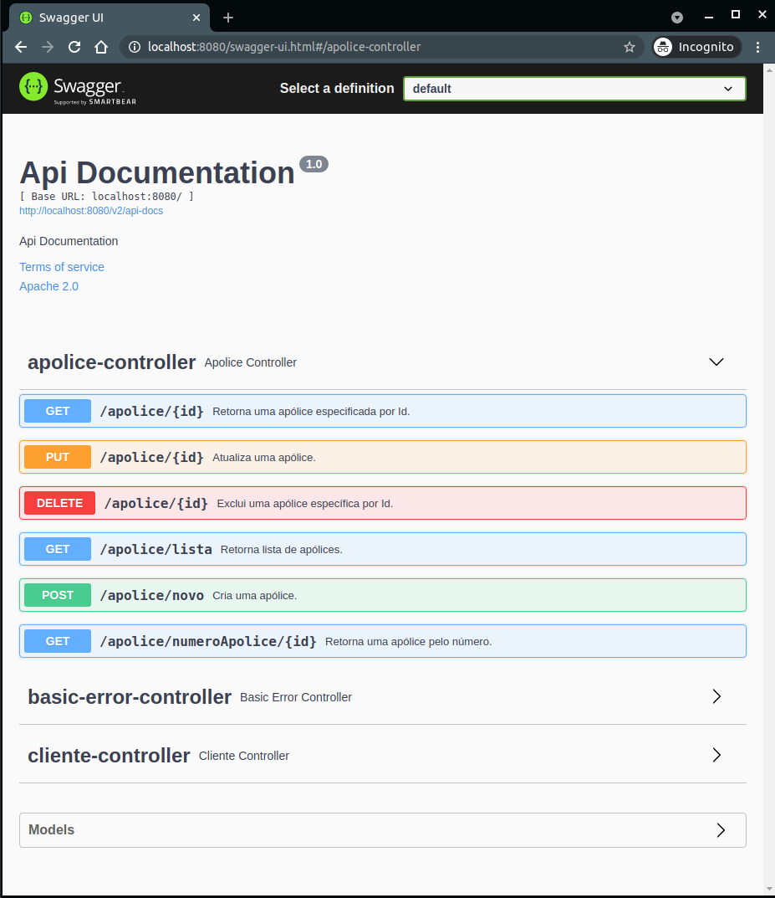

# Desafio Equiplano - API REST - Seguradora de Veículos
É uma aplicação REST API, que dá acesso aos endpoints (CRUD) para os sistemas de uma empresa de seguros.

Foi criada para atender o desafio proposto pela empresa Equiplano para preenchimento da vaga de Desenvolvedor Java.

Para acessar a aplicação, seguir os passos abaixo.

### 1. Como executar o projeto
Dentro da pasta do projeto, executar o seguinte comando:
>$ java -jar seguradora-0.0.1-SNAPSHOT.war
 
  

### 2. Acessando a aplicação
Para acessar a aplicação, utilize o Postman ou Insomnia. Faça os imports dos endpoints que estão na pasta do projeto para facilitar o acesso.

>/seguradora/Postman

Também foi criado o acesso via SwaggerUI, que pode ser acessado através da URL após execução do projeto no passo anterior:
> http://localhost:8080/swagger-ui.html
 
  

### 3. Navegando entre os endpoints
Após acessar os endpoints pelo Swagger, clique no menu desejado e selecione quais operações deseja fazer (GET, POST, PUT, DELETE).

- Cliente  

  

- Apólice  

  

Também é possível visualizar os atributos das classes e seus tipos de dados. 
